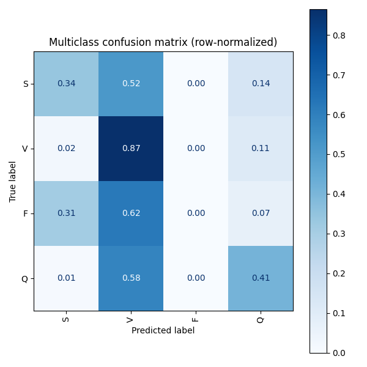
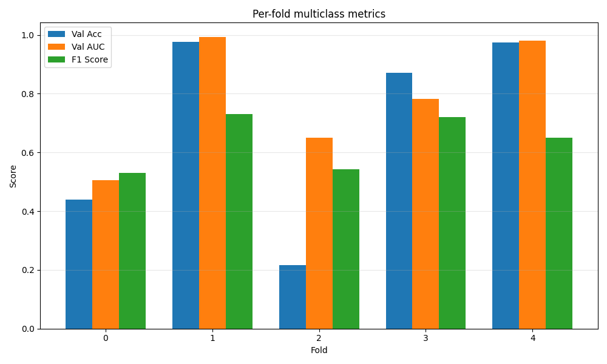
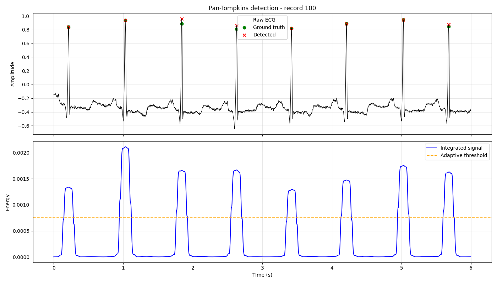
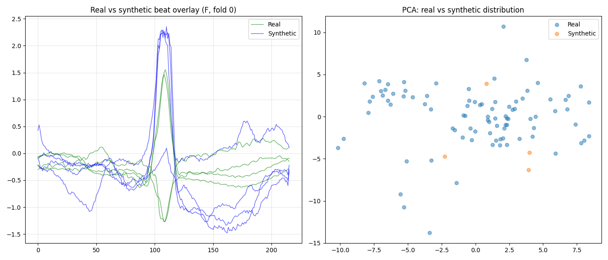

# ECG Report AI

## Overview

ECG Report AI is an end-to-end Machine Learning project focused on automated ECG (Electrocardiogram) classification using Deep Learning techniques.

The project was built to demonstrate practical Machine Learning Engineering skills across the complete ML lifecycle, including model development, experimentation, validation, cloud-assisted training, containerized deployment, CI/CD automation, and model lifecycle management.

Rather than focusing solely on model performance, the project emphasizes reproducibility, maintainability, deployment readiness, and industry-standard MLOps practices — including honestly reporting what the system does and does not yet do well (see [Known Limitations](#known-limitations)).

The system analyzes ECG recordings from the MIT-BIH Arrhythmia Database and serves predictions through a Streamlit application connected to a containerized inference API.

> **Evaluation snapshot: 2026-08-20.** All numbers below come from a real evaluation job run against the live cascade (Pan-Tompkins → binary → multiclass) on held-out MIT-BIH patients — not training-time metrics, and reported with 95% bootstrap confidence intervals (resampled by patient, not by beat) rather than bare point estimates. Re-running the evaluation pipeline against a newer training job will produce different numbers; this README reflects the most recent run only.

---

# Project Objectives

The main goals of the project are:

* Build an automated ECG classification system.
* Develop robust binary and multiclass classification models.
* Apply cross-validation for reliable evaluation.
* Implement Champion vs Challenger model selection.
* Create a reproducible ML workflow.
* Deploy inference through containerized services.
* Utilize Azure for scalable model training and comparison.
* Explore synthetic ECG generation to improve generalization.

---

# Key Features

## Machine Learning

* Binary ECG classification (Normal vs. anomaly)
* Multiclass ECG classification (AAMI classes S/V/F/Q)
* Deep Learning models built with TensorFlow/Keras (Inception-Conformer architecture)
* Custom Pan-Tompkins R-peak detector, shared between the inference service and the evaluation pipeline
* Cross-validation-based evaluation (patient-level `StratifiedGroupKFold`)
* Model comparison framework (Champion vs Challenger)
* Hyperparameter experimentation
* Synthetic data augmentation using WGAN-GP (see [WGAN-GP Case Study](#wgan-gp-case-study))

## MLOps

* CI/CD pipeline
* Automated validation
* Dockerized inference
* Experiment tracking (MLflow, via Azure ML)
* Model versioning
* Champion vs Challenger workflow, computed inside the Azure ML evaluation job

## Cloud Integration

* Azure-based training and evaluation workflows
* Model artifact storage
* Centralized model comparison

## Application Layer

* Streamlit frontend
* FastAPI inference backend
* Containerized prediction service

---

# Dataset

The project uses the MIT-BIH Arrhythmia Database, one of the most widely recognized benchmark datasets for ECG classification research.

Dataset characteristics:

* Expert-annotated ECG recordings
* Clinically validated labels
* Public research benchmark
* High-quality and clean ECG signals

Because the dataset already contains clean ECG recordings, no advanced signal denoising or signal processing pipeline was required. The project focuses primarily on machine learning, model evaluation, deployment, and MLOps engineering.

---

# System Architecture

```text
                MIT-BIH Dataset
                        │
                        ▼
              Pan-Tompkins R-peak Detection
                        │
                        ▼
             Stage 1: Binary Classifier
              (Normal vs. Anomaly)
                        │
              anomaly?  ▼  (only anomalies proceed)
             Stage 2: Multiclass Classifier
                  (AAMI: S / V / F / Q)
                        │
                        ▼
                Cross-Validated Training
                (patient-level StratifiedGroupKFold)
                        │
                        ▼
          Azure ML Evaluation Job (cascade metrics,
           baselines, benchmarks, promotion decision)
                        │
                        ▼
              Champion vs Challenger
                        │
                        ▼
                Model Artifact Store
                        │
                        ▼
                 Docker Container
                        │
                  FastAPI Inference
                        │
                        ▼
                Streamlit Frontend
```

---

# Technology Stack

## Machine Learning

* Python
* TensorFlow / Keras
* Scikit-Learn
* NumPy / Pandas
* SciPy (Pan-Tompkins signal processing)

## MLOps & DevOps

* Git
* GitHub
* GitHub Actions (CI only — lint/tests, no Azure calls)
* Docker
* CI/CD Pipelines

## Cloud

* Microsoft Azure Machine Learning
* Azure Storage

## Application

* Streamlit
* FastAPI

## AI-Assisted Development

* Claude Code and Gemini Code Assist

Claude Code and Gemini Code Assist were used as productivity tools during development for code generation, refactoring support, documentation assistance, and development acceleration. All architectural decisions, model design choices, experimentation, and implementation remained under developer supervision.

Beyond code generation, Claude Code was used hands-on to design and build the Azure ML evaluation pipeline described in this README (`src/evaluation/generate_report.py`, `src/cascade.py`, the fold-split persistence in `multistage_train.py`) and to diagnose and fix a series of real issues hit while getting it running end-to-end on Azure, including: a subscription vCPU quota mismatch on `cpu-cluster` (`max_instances` sized beyond the Standard DSv2 quota), an invalid `azureml://jobs/...` URI format for mounting a prior job's outputs (fixed by downloading job outputs locally instead), an import bug (`load_data` pulled from the wrong module), a missing `fold_splits_binary.json` caused by the training job only running `--task multiclass` instead of `--task both`, and a broken `mlflow`/`azureml-mlflow` artifact-store plugin (`azure-ai-ml` was also missing from `conda.yml` entirely, which silently broke the in-job Champion lookup). All of these were found by actually running the pipeline against live Azure ML jobs, not by inspection alone.

---

# Training Workflow

The model development process follows a structured workflow:

1. Dataset preparation
2. Cross-validation training (binary + multiclass, both stages in one job)
3. WGAN-GP minority-class augmentation (multiclass stage only)
4. Cascade evaluation on held-out patients (Azure ML evaluation job)
5. Champion vs Challenger comparison (computed inside the evaluation job)
6. Model artifact registration (local, interactive — see [MLOps Pipeline](#mlops-pipeline))
7. Deployment to inference environment

This approach ensures consistent evaluation and repeatable experimentation.

---

# Model Evaluation

## Cascade End-to-End Results (headline metric)

This is the number that matters most: running the *actual* production pipeline (Pan-Tompkins detection → Stage 1 binary → Stage 2 multiclass) on held-out MIT-BIH patients, matching detected peaks back to ground-truth annotations (±5 samples).

Earlier snapshots of this section evaluated only 9 (then 5) held-out records, because the binary and multiclass cross-validation folds are computed independently and a patient held out of *both* stages was found only by intersecting fold indices that happened to match — mostly by luck. That was fixed by pairing each patient with the specific binary/multiclass model pair that actually never saw them, regardless of fold index (`src/evaluation/fold_pairing.py`), recovering the full eligible population.

| Metric | Value |
| --- | --- |
| **Cascade macro F1** | **0.2792** (95% CI: 0.2206–0.3476) |
| Cascade weighted F1 | 0.7464 |
| Cascade accuracy | 0.7623 |
| Records evaluated | 37 |

Per-class breakdown at the cascade output:

| Class | Precision | Recall | F1 | Support |
| --- | --- | --- | --- | --- |
| N | 0.8615 | 0.9033 | 0.8819 | 62,127 |
| S | 0.1606 | 0.0331 | 0.0549 | 1,056 |
| V | 0.2209 | 0.3163 | 0.2601 | 5,564 |
| F | 0.0000 | 0.0000 | 0.0000 | 778 |
| Q | 0.2910 | 0.1512 | 0.1990 | 8,043 |

All five classes now clear the 30-example support floor used elsewhere in this project (`--min-support-floor` in `generate_report.py`), so macro F1 above isn't being distorted by a class measured on a handful of examples — a real risk at the smaller record counts of earlier snapshots.

**Where true anomalous beats are lost** (15,441 true anomalies total across the 37 patients):

| Outcome | Count | Share |
| --- | --- | --- |
| Missed by the R-peak detector | 5,650 | 36.6% |
| Detected, but classified Normal by Stage 1 | 3,373 | 21.8% |
| Reached Stage 2, but misclassified | 3,407 | 22.1% |
| Correctly classified end-to-end | 3,011 | **19.5%** |

Still about 1 in 5 true anomalous beats survives the full cascade correctly — consistent with the very first (9-record) measurement's 18.8%, despite a completely different patient set and evaluation methodology, which is a reassuring sign that number is real rather than small-sample noise. What changed with fuller patient coverage is *where* the loss concentrates: the R-peak detector's share nearly doubled (20.7% → 36.6%), most likely because records 104 and 108 — already known from [Pan-Tompkins Detector Validation](#pan-tompkins-detector-validation) to have far worse detector sensitivity than the rest of the dataset — are now properly weighted in the full patient population instead of being absent or under-represented by chance. This re-prioritizes detector robustness above where it sat in earlier snapshots (see [Known Limitations](#known-limitations)).



---

## Stage 1 — Binary (Normal vs. Anomaly)

Clinical metrics, pooled across all 5 CV folds:

| Metric | Value |
| --- | --- |
| Sensitivity (recall on anomalies) | **0.6590** |
| Specificity | 0.9031 |
| PPV | 0.5004 |
| NPV | 0.9473 |

Stage 1 sensitivity is the ceiling on the whole cascade: every anomaly missed here can never reach Stage 2. It was previously 0.5768 (specificity 0.8951) — the improvement came from fixing how the binary-stage cross-validation split is stratified. `StratifiedGroupKFold` was splitting on the flattened Normal-vs-anomaly label, which is blind to AAMI subtype; that let one CV fold accidentally concentrate ~60% of all class S beats (supraventricular ectopic — morphologically the hardest to distinguish from Normal) in its validation set, forcing a near-zero decision threshold just to detect them. Re-stratifying by AAMI subtype instead fixed this: sensitivity, specificity, and PPV all improved *simultaneously* (not a sensitivity/specificity trade-off), and no CV fold's AUC is catastrophically low anymore.

**Recalibrating the decision threshold away from 0.5 was tried and rejected.** Two approaches were tested: (1) picking a threshold that hits 90% Stage 1 sensitivity in isolation, and (2) sweeping candidate thresholds through the *full* cascade and ranking by the resulting cascade macro F1. Both were measured against the real cascade output, not just Stage 1 metrics — approach (1) reliably *hurts* cascade macro F1 (0.2792 → 0.2359) by flooding Stage 2 with false positives from the resulting collapse in specificity; approach (2)'s best candidate (threshold 0.3) beat the 0.5 default by less than its own bootstrap confidence interval, i.e. within noise. The default threshold of 0.5 stays.

## Stage 2 — Multiclass (AAMI: S / V / F / Q)

Aggregate classification report across all 5 folds (window-level, not the cascade — see above for the end-to-end number):

| Class | Precision | Recall | F1 | Support |
| --- | --- | --- | --- | --- |
| S | 0.5264 | 0.5231 | 0.5248 | 648 |
| V | 0.5068 | 0.9018 | 0.6489 | 4,765 |
| F | 0.0000 | 0.0000 | 0.0000 | 103 |
| Q | 0.8976 | 0.4936 | 0.6369 | 8,041 |

| Metric | Value |
| --- | --- |
| Macro F1 | 0.4526 |
| Weighted F1 | 0.6309 |
| Accuracy | 0.6347 |
| Mean CV AUC | 0.8586 |

**Per-fold breakdown — variance is still the dominant story here.** Only the binary stage's CV stratification was fixed (see Stage 1 above); the multiclass split is unchanged and shows it:

| Fold | Val Acc | Val AUC | Macro F1 | Weighted F1 |
| --- | --- | --- | --- | --- |
| 0 | 0.8863 | 0.9866 | 0.6070 | 0.8884 |
| 1 | 0.9814 | 0.9981 | 0.6716 | 0.9786 |
| 2 | 0.1952 | 0.5214 | 0.1365 | 0.0711 |
| 3 | 0.6884 | 0.8063 | 0.2731 | 0.7751 |
| 4 | 0.9862 | 0.9803 | 0.5435 | 0.9891 |

Val accuracy ranges from 0.20 to 0.99 across 5 folds of the *same* model and pipeline. Against majority-class and stratified-random baselines, the model clearly beats both in 4 of 5 folds — but **loses to both baselines in fold 2** (model macro F1 0.137 vs. baseline 0.218/0.226), which the aggregate numbers above would otherwise hide. A local audit (`notebooks/class_distribution_audit.py`) traced this to the same root cause as the binary fix above, not yet applied to multiclass: a handful of "carrier" patients hold almost all of a given class's examples (e.g. 4 patients hold 99.8% of all class Q windows), so which fold they land in swings that fold's class balance heavily. Fold 2 specifically got carrier patients for *two* classes (Q and S) at once.



---

## Pan-Tompkins Detector Validation

Extended from an earlier 2-record spot check to 10 MIT-BIH records, tolerance ±5 samples:

| Metric | Value |
| --- | --- |
| Aggregate sensitivity | 0.8840 |
| Aggregate PPV | 0.9556 |

Per-record, most are ≥0.97 sensitivity, but two records are notably worse — record 104 (0.5464) and record 108 (0.5026) — both known in the MIT-BIH literature for atypical/noisy morphology, suggesting the detector's fixed adaptive-threshold parameters don't generalize to every recording condition.

These same two records turn out to matter more than this 10-record spot check alone suggests: once the [cascade evaluation](#cascade-end-to-end-results-headline-metric) covered its full eligible patient population instead of a small lucky subset, missed detections became the single largest category of lost anomalies (36.6% of all anomaly loss) — larger than either classification stage's own errors. Improving detector robustness on records like these is now a higher-priority lever than the original 2-record framing implied.



---

## CPU Inference Benchmarks

Measured on the training/evaluation compute (`Standard_DS3_v2`, 4 vCPU, CPU-only):

| Metric | Value |
| --- | --- |
| Mean Pan-Tompkins detection time | 0.041 s/record |
| Mean Stage 1 (binary) inference time | 1.314 s/record |
| Mean Stage 2 (multiclass) inference time | 0.485 s/record |
| Per-beat latency (mean) | 0.92 ms |
| Per-beat latency (p95) | 1.29 ms |
| **Batched vs. per-window `predict()` speedup** | **~88x** |
| Binary model parameters | 438,081 |
| Multiclass model parameters | 438,468 |
| Binary model size | 5.4 MB |
| Multiclass model size | 5.4 MB |

The ~88x batching speedup quantifies the payoff of refactoring `run_stream` from sequential to batched inference in the FastAPI service.

---

## WGAN-GP Case Study

WGAN-GP (Conv1DTranspose generator/critic, `d_steps=3`, gradient penalty) is used to top up rare AAMI classes (S, F, sometimes V) during multiclass training, capped at +5% growth per class per fold to avoid overwhelming real data with synthetic samples.

A matching pair of training runs — one with GAN augmentation, one with `--skip-gan-augmentation` — were evaluated fold-by-fold:

| Fold | Val Acc (GAN) | Val Acc (no-GAN) | Difference |
| --- | --- | --- | --- |
| 0 | 0.4388 | 0.4889 | -0.0500 |
| 1 | 0.9760 | 0.9736 | +0.0023 |
| 2 | 0.2166 | 0.3199 | -0.1033 |
| 3 | 0.8711 | 0.7967 | +0.0744 |
| 4 | 0.9739 | 0.9501 | +0.0238 |

**Verdict: inconclusive.** Mean Val Acc difference across folds is -0.0106, well within the ±0.347 inter-fold standard deviation — the GAN's effect, whatever it is, is currently smaller than the noise already present from patient-level fold variance. This is a real, measured result, not a placeholder: at the current augmentation strength and dataset size, WGAN-GP augmentation has not been shown to move the needle.



---

# Champion vs Challenger Strategy

A Champion vs Challenger framework supports continuous model improvement.

## Champion

The currently registered best-performing model (`ecg_multiclass_model` in the Azure ML model registry).

## Challenger

A newly trained candidate model, evaluated against the Champion by the Azure ML **evaluation job itself** — not by a local or CI script.

The evaluation job computes `cascade_macro_f1` (the end-to-end metric above, not just per-window CV AUC) for the challenger, looks up the current Champion's score, and writes `promotion_decision.json` with the verdict and reasoning. This runs inside the job, authenticated via the compute cluster's own managed identity — never with a local or CI credential.

This strategy reflects real-world Machine Learning deployment practices where model replacement requires objective, end-to-end validation rather than relying solely on training-time metrics.

---

# MLOps Pipeline

The full loop is **Continuous Training (CT) → Evaluation → Continuous Delivery (CD)**, and it is split across two trust boundaries because of a hard constraint: **the Azure subscription backing this project is a student subscription that does not support service-principal credentials**, so nothing outside Azure can authenticate to the workspace headlessly.

* **CT and Evaluation run entirely on Azure ML**, submitted by local orchestration scripts that are intentionally not tracked in this repo (they're workspace-specific — see `.gitignore`). The evaluation job also computes the Champion vs Challenger decision in-job, using the compute's managed identity — no interactive login needed there.
* **CD is local and interactive** (`src/evaluate_and_register.py`): it reads `promotion_decision.json` from the evaluation job's outputs using `InteractiveBrowserCredential` (a real browser login, run by a person), and if promoted, registers the new Champion model.
* **GitHub Actions stays limited to code CI** — lint and tests only. It never authenticates to Azure, by design (the commented-out CT step in `.github/workflows/mlops.yml` reflects an earlier, abandoned attempt at a service-principal-based GitHub Actions flow).
* The PR step (auto-branch + `gh pr create`) also runs locally, immediately after a successful CD, using the developer's own `git`/`gh` credentials.

This is not a workaround to be fixed later — it's the correct shape of the pipeline given the auth constraint, and it mirrors how a team without org-wide service-principal access would actually have to run this in production.

---

# Model Versioning

The project includes model versioning based on Keras model artifacts, registered in the Azure ML model registry and tagged with the metrics that justified promotion (`cascade_macro_f1`, `cv_mean_val_auc`, `binary_sensitivity`, `binary_specificity`).

Benefits:

* Traceability
* Reproducibility
* Rollback capability
* Easier deployment management

---

# Azure Integration

Microsoft Azure ML is used as a training, evaluation, and experimentation platform.

Azure responsibilities:

* Running training and evaluation workloads on `cpu-cluster` (`Standard_DS3_v2`, CPU-only, capped at `max_instances=1` to respect the subscription's 6-vCPU DSv2 family quota)
* Comparing model candidates (Champion vs Challenger, computed in-job)
* Storing trained model artifacts and evaluation reports
* MLflow experiment tracking, native to Azure ML

Inference is intentionally separated from Azure and handled through Docker-based services, enabling deployment flexibility and infrastructure independence.

---

# Containerized Inference

The prediction engine operates inside a Docker container.

Inference workflow:

1. User uploads ECG data through Streamlit.
2. Streamlit sends a request to the API.
3. The FastAPI service runs the same cascade logic (`src/cascade.py`) used by the evaluation job — Pan-Tompkins detection, batched Stage 1, batched Stage 2 on anomalies only.
4. Results are returned to the frontend.

`src/cascade.py` and `src/pan_tompkins.py` are shared, dependency-light modules (no FastAPI/pydantic imports) reused by both the live inference service and the offline evaluation pipeline, so "what the model does in production" and "what got measured" are guaranteed to be the same code path.

Advantages:

* Consistent runtime environment
* Simplified deployment
* Reproducible inference
* Better scalability
* Infrastructure portability

---

# CI/CD Pipeline

The project follows modern software engineering practices using automated CI/CD workflows.

Pipeline stages include:

1. Source code validation
2. Automated testing (`pytest tests/`, including `tests/test_cascade.py` for the shared cascade/detector logic — runs with no Azure credentials or GPU required)
3. Dependency verification
4. Build validation
5. Deployment preparation

Benefits:

* Reduced deployment risk
* Faster feedback cycles
* Improved code quality
* Reproducible releases

---

# Experiment Tracking

Training runs, model artifacts, validation metrics, and candidate models are systematically stored and compared via MLflow (Azure ML-native) to support reproducible experimentation and informed model selection.

The project emphasizes evidence-based model promotion — via the cascade-level evaluation job — rather than relying solely on individual training-run metrics.

---

# Reproducibility

The project was designed with reproducibility as a core principle.

Implemented practices include:

* Dockerized environments
* Version-controlled source code
* Versioned model artifacts
* Persisted per-fold train/val patient splits (`fold_splits_binary.json`, `fold_splits_multiclass.json`) so any past training run's validation partitions can be reconstructed exactly, without re-running the non-deterministic parts of preprocessing
* Automated CI validation
* Standardized evaluation workflows (`--fold`, `--records` flags for cheap smoke-testing before a full run)

---

# Known Limitations

This section is deliberately blunt — these are measured findings from the evaluation snapshot above, not hypothetical caveats.

* **Cascade macro F1 is low (0.28, 95% CI 0.22–0.35).** Only ~19.5% of true anomalous beats are classified correctly end-to-end; the rest are lost across detection (36.6%), Stage 1 false-negatives (21.8%), and Stage 2 misclassification (22.1%). This is a compounding-error problem across all three stages, not a single fixable bottleneck — and the detector is now the single largest contributor, not an equal third.
* **Stage 1 sensitivity (0.659) has improved but is still the practical ceiling on the whole system.** Fixing the CV split's stratification (it was blind to AAMI subtype) raised it from 0.577 without trading away specificity or precision — but every anomaly still missed here can never reach Stage 2. Recalibrating the decision threshold away from 0.5 was tried two ways and rejected both times: it either measurably hurts cascade macro F1, or its apparent gain is within bootstrap noise (see Stage 1 above).
* **Multiclass performance is highly unstable across folds** (val accuracy 0.20–0.99, same model/data pipeline). Fold 2 in particular has the model *losing* to a trivial majority-class baseline. Traced to a small number of patients holding almost all of a given class's examples (e.g. 4 patients hold 99.8% of class Q) — the same root cause as the binary-stage issue above, not yet fixed for multiclass.
* **Class F (fusion beats) is not learned at all** — 0.0 precision and recall throughout, both at the window level and in the cascade. F has the fewest samples of any AAMI class; the current data volume can't support learning it.
* **WGAN-GP augmentation shows no measurable benefit** at current settings (mean Val Acc difference -0.011, within a ±0.347 inter-fold noise band) — see [WGAN-GP Case Study](#wgan-gp-case-study). Measured before the binary CV stratification fix above; not yet re-validated against it.
* **The Pan-Tompkins detector degrades on atypical records** (0.50–0.55 sensitivity on 2 of 10 tested records vs. ~0.97+ on the rest). At full cascade evaluation scale this is no longer a minor caveat: it's the largest single source of lost anomalies (36.6% of all cascade loss) — its fixed thresholding doesn't generalize to every signal condition in MIT-BIH.
* **Small dataset overall**: `--selected-samples 40` records, which limits both training data volume and how representative each CV fold can be.

---

# Technical Challenges

Key challenges encountered during development:

* ECG class imbalance, especially the near-absence of class F
* Patient-level fold variance dominating multiclass results on a small dataset
* Compounding error across a 3-stage cascade (detection → binary → multiclass)
* Getting a real, end-to-end (not just per-window) evaluation pipeline running reliably on Azure ML, including several live infrastructure bugs (quota limits, job-output URI resolution, mlflow/azureml-mlflow version mismatches, missing dependencies)
* Comparing multiple model candidates fairly under a hard no-service-principal auth constraint
* Managing model versions
* Designing deployment-ready architecture shared between inference and evaluation

---

# Lessons Learned

The project provided practical experience in:

* Cross-validation strategies, and their limits on small, patient-grouped datasets
* Deep Learning model evaluation — and why per-window CV metrics can look fine while the true end-to-end system metric doesn't
* Model lifecycle management
* Cloud-assisted experimentation, including debugging real Azure ML infrastructure issues (quota, job-output referencing, environment/dependency drift)
* Docker-based deployment
* CI/CD integration for ML systems
* Trade-offs between accuracy and generalization
* Production-oriented ML development

---

# Potential Use Cases

Potential applications include:

* Clinical decision support systems
* ECG screening tools
* Telemedicine platforms
* Research environments
* Medical AI prototyping
* Healthcare analytics solutions

(Given the current [Known Limitations](#known-limitations), the system today is a research/portfolio-stage prototype, not something ready for any of the above without further work on Stage 1 sensitivity and fold stability.)

---

# Roadmap

## Completed

* Binary classification model
* Multiclass classification model
* Cross-validation workflow
* Azure-based training (both stages, one job)
* WGAN-GP minority-class augmentation, evaluated fold-by-fold against a no-GAN baseline
* End-to-end cascade evaluation pipeline on Azure ML (Pan-Tompkins + both stages, baselines, CPU benchmarks, in-job promotion decision)
* Dockerized inference
* REST API integration
* Streamlit frontend
* CI/CD implementation
* Champion vs Challenger evaluation (now computed in-job, not locally)
* Model versioning

## In Progress

* Pan-Tompkins detector robustness on atypical records (now the single largest source of cascade loss at full evaluation scale — reprioritized above the other items below)
* Improving Stage 1 sensitivity further (0.577 → 0.659 via CV stratification fix; still the practical ceiling on the cascade). Threshold recalibration away from 0.5 was tried and rejected — see Stage 1 above.
* Reducing multiclass fold-to-fold variance by applying the same CV stratification fix used for Stage 1 (root cause confirmed the same: a few patients dominate a given class's examples)
* Making WGAN-GP augmentation actually move the needle, or concluding it isn't the right lever for this dataset size

---

# Skills Demonstrated

This project showcases practical competencies relevant to Machine Learning Engineering roles.

## Machine Learning

* Deep Learning
* Classification Models
* TensorFlow/Keras
* Cross Validation
* Model Evaluation (including honest end-to-end system evaluation, not just per-window metrics)
* Hyperparameter Experimentation

## MLOps

* CI/CD
* Docker
* Model Versioning
* Experiment Tracking
* Champion vs Challenger Strategy, designed around a real cloud-auth constraint

## Cloud Engineering

* Microsoft Azure ML
* Training and evaluation infrastructure
* Artifact management
* Live debugging of cloud quota, credential, and dependency issues

## Software Engineering

* REST APIs
* Modular Architecture (shared cascade logic between service and evaluation pipeline)
* Deployment Workflows
* Reproducible Systems
* Version Control

## AI Engineering

* Generative AI Integration (WGAN-GP)
* Claude Code / Gemini Code Assist
* ML System Design
